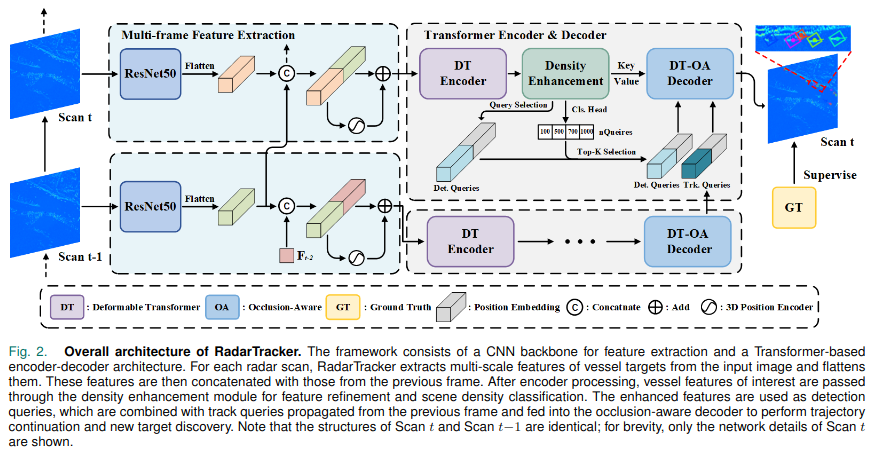
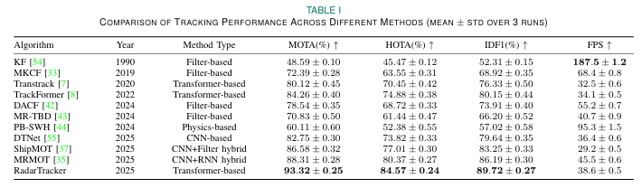

# RadarTracker
This is the official implementation for our paper:

**RadarTracker: An End-to-End Transformer Framework for Vessel Tracking using X-Band Marine Radar**

**Zihang Wang, Xu Li, Member, IEEE, Chi Tian, Liang Xia, Wenkai Zhu, and Yiming Peng**

The following diagram illustrates the RadarTracker framework, showcasing the end-to-end transformer-based approach for vessel tracking using X-band marine radar. This method integrates advanced techniques to efficiently track vessels in challenging radar environments.



The following table presents the quantitative results from our experiments. These results demonstrate the effectiveness of the RadarTracker framework in various vessel tracking scenarios using X-band marine radar data.

<p align="center">
  
</p>

### Training Instructions

To train the RadarTracker model, run the following command:
```bash
python src/train.py with \
    mrmvt \
    deformable \
    multi_frame \
    tracking \
    output_dir=models/mrmvt_deformable_multi_frame
```

This will start training the model using the mrmvt dataset, the deformable model, multi-frame tracking, and saving the output in the specified directory (models/mrmvt_deformable_multi_frame).

### Testing Instructions

To test the trained RadarTracker model, run the following command:
```bash
python src/track.py with \
    dataset_name=mrmvt \
    data_root_dir=data/mrmvt \
    output_dir=data/mrmvt \
    write_images=pretty
```

This command will test the model on the mrmvt dataset, using the provided data directory (data/mrmvt), and output the results in the specified directory (data/mrmvt).


