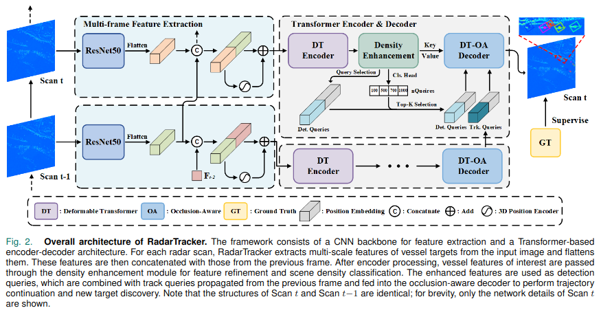

# RadarTracker
This is the official implementation for our paper:
RadarTracker: An End-to-End TransformerFramework for Vessel Tracking using X-BandMarine Radar

Zihang Wang, Xu Li,Member, IEEE, Chi Tian, Liang Xia, Wenkai Zhu and Yiming Peng

We will release the code and relevant data upon the acceptance of our paper.